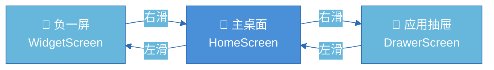
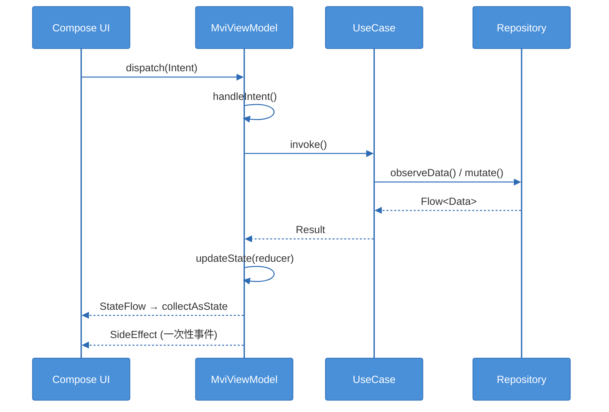
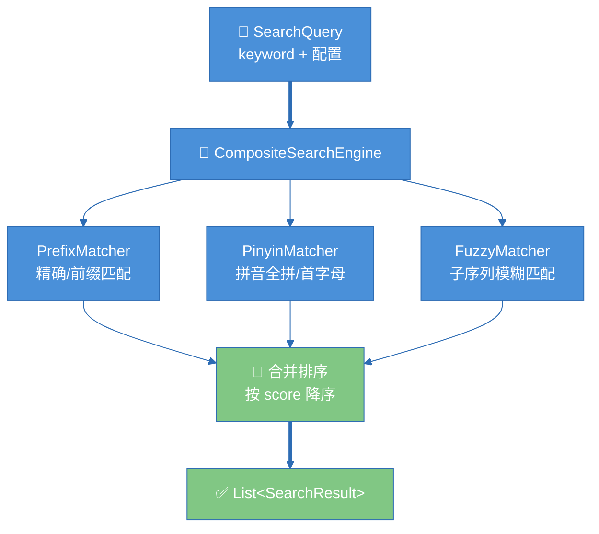

# Wades Launcher 架构技术文档

## 背景

Wades Launcher 是一款创新型 Android Launcher，核心创新点：单页垂直滚动桌面 + 分组水平滑动 + 滑动变阻搜索栏 + 左滑负一屏/右滑抽屉。作为个人技术深度展示项目，充分运用 MVI + Clean Architecture + 多模块架构，并系统性地应用了 10 种设计模式。

- 包名：`com.wades.launcher`
- minSdkVersion：26 (Android 8.0)
- 技术栈：Kotlin · Jetpack Compose · MVI · Clean Architecture · Hilt · Room · Coroutines + Flow · Gradle KTS

## 架构概览

```mermaid
%%{init: {'theme': 'base', 'themeVariables': {'primaryColor': '#4A90D9', 'primaryTextColor': '#FFFFFF', 'primaryBorderColor': '#2D6CB4', 'secondaryColor': '#67B7DC', 'tertiaryColor': '#E8F4FD', 'lineColor': '#2D6CB4', 'noteTextColor': '#333333', 'noteBkgColor': '#FFF8E1'}}}%%
graph TD
    subgraph 📱 App层
        A[":app<br/>入口 · Hilt根 · 三屏导航"]
    end

    subgraph 📱 Feature层
        B[":feature:home<br/>主桌面 · 分组 · 搜索"]
        C[":feature:drawer<br/>应用抽屉 · A-Z列表"]
        D[":feature:widget<br/>负一屏 · 小部件"]
    end

    subgraph 🖥️ Core层
        E[":core:domain<br/>Entity · Repository接口 · UseCase"]
        F[":core:data<br/>Impl · Room · PM · 搜索引擎"]
        G[":core:ui<br/>MVI基类 · 主题 · 共享组件"]
    end

    A ==> B
    A ==> C
    A ==> D
    B --> E
    B --> G
    C --> E
    C --> G
    D --> E
    D --> G
    F -.-> E

    style A fill:#4A90D9,color:#FFFFFF
    style B fill:#67B7DC,color:#FFFFFF
    style C fill:#67B7DC,color:#FFFFFF
    style D fill:#67B7DC,color:#FFFFFF
    style E fill:#81C784,color:#FFFFFF
    style F fill:#FFB74D,color:#FFFFFF
    style G fill:#CE93D8,color:#FFFFFF
```

依赖方向：`:app` → `:feature:*` → `:core:domain` + `:core:ui`，`:core:data` 实现 `:core:domain` 接口（依赖反转）。

## 模块划分（7 个模块）

| 模块 | 职责 | 关键文件 |
|------|------|----------|
| `:app` | Application 入口、Hilt 根组件、HorizontalPager 三屏导航 | `WadesApp.kt`, `MainActivity.kt`, `AppModule.kt` |
| `:feature:home` | 主桌面：单页滚动、分组列表、搜索栏、编辑模式 | `HomeScreen.kt`, `HomeViewModel.kt`, `HomeContract.kt` |
| `:feature:drawer` | 右滑抽屉：全部应用 A-Z 列表 + 搜索 | `DrawerScreen.kt`, `DrawerViewModel.kt` |
| `:feature:widget` | 左滑负一屏：AppWidgetHost、小部件管理 | `WidgetScreen.kt`, `LauncherWidgetHost.kt` |
| `:core:domain` | 纯 Kotlin：Entity、Repository 接口、UseCase（零 Android 依赖） | `AppInfo.kt`, `GetGroupedAppsUseCase.kt` |
| `:core:data` | Repository 实现、PackageManager 数据源、Room、IconCache、搜索引擎 | `AppRepositoryImpl.kt`, `CompositeSearchEngine.kt` |
| `:core:ui` | 共享 Compose 组件、主题、动画工具、MVI 基类 | `MviViewModel.kt`, `WadesTheme.kt`, `AppIcon.kt` |

## 核心流程

### 三屏导航流程



实现方式：`HorizontalPager(pageCount=3, initialPage=1)`，`beyondViewportPageCount=1` 预加载相邻页。

### MVI 数据流



### 搜索流程



## 设计决策

### 1. MVI 而非 MVVM
选择 MVI 是因为 Launcher 的 UI 状态复杂（编辑模式、搜索状态、分组展开等），MVI 的单一状态源 + 不可变状态 + 意图驱动模式更适合管理这种复杂度。`MviViewModel` 抽象基类（模板方法模式）统一了所有 ViewModel 的骨架。

### 2. 纯 Kotlin Domain 层
`:core:domain` 模块使用 `kotlin-jvm` 插件，零 Android 依赖。这确保了业务逻辑的可测试性和可移植性，UseCase 可以在纯 JVM 环境下单元测试。

### 3. 策略模式搜索引擎
搜索引擎采用策略模式 + 组合模式：`SearchMatcher` 接口定义匹配策略，`PrefixMatcher`/`PinyinMatcher`/`FuzzyMatcher` 三种实现，`CompositeSearchEngine` 组合聚合。新增匹配策略只需实现接口并注入，符合开闭原则。

### 4. 图标三级缓存
`IconCache` 采用代理模式，三级缓存策略：内存 LruCache → 磁盘 WebP → PackageManager。避免频繁调用 PM 加载图标导致的性能问题。

### 5. Room 持久化
分组布局和应用使用统计通过 Room 持久化，确保用户自定义的桌面布局在重启后保留。使用 Flow 观察数据变化，自动驱动 UI 更新。

## 设计模式清单

| 模式 | 位置 | 实现 |
|------|------|------|
| **Repository** | Data 层 | `AppRepository`/`LayoutRepository` 接口 + Impl，封装数据访问 |
| **策略** | 搜索引擎 | `SearchMatcher` 接口 → `PrefixMatcher`/`PinyinMatcher`/`FuzzyMatcher` |
| **组合** | 搜索引擎 | `CompositeSearchEngine` 聚合多个 Matcher |
| **观察者** | Presentation | `StateFlow` + `collectAsStateWithLifecycle` 驱动 Compose |
| **工厂** | DI | Hilt `@Module` `@Provides` 创建依赖实例 |
| **适配器** | Data 层 | `GroupMapper` — `GroupEntity.toDomain()` / `LauncherGroup.toEntity()` |
| **代理** | 图标缓存 | `IconCache` 三级缓存（内存→磁盘→PM） |
| **建造者** | 搜索 | `SearchQuery` data class + 默认参数构建查询 |
| **模板方法** | MVI 基类 | `MviViewModel` 骨架，子类实现 `handleIntent` |
| **依赖注入** | 全局 | Hilt `@HiltViewModel` / `@Inject` / `@Binds` |

## API 文档

### Domain 模型

```kotlin
data class AppInfo(packageName, label, componentName, shortcuts, usageCount, lastUsedTimestamp, isHidden)
data class LauncherGroup(id, name, sortOrder, appPackageNames, type, isExpanded)
data class LauncherLayout(groups, config)
data class SearchQuery(keyword, matchPinyin=true, matchFuzzy=true, maxResults=20)
data class SearchResult(app, matchType, score)
data class WidgetInfo(id, appWidgetId, packageName, label, spanX, spanY, sortOrder)
```

### Repository 接口

```kotlin
interface AppRepository {
    fun observeAllApps(): Flow<List<AppInfo>>
    suspend fun getAppByPackageName(packageName: String): AppInfo?
    suspend fun updateUsageCount(packageName: String)
    suspend fun setHidden(packageName: String, hidden: Boolean)
}

interface LayoutRepository {
    fun observeLayout(): Flow<LauncherLayout>
    suspend fun saveGroup(group: LauncherGroup)
    suspend fun deleteGroup(groupId: String)
    suspend fun addAppToGroup(groupId: String, packageName: String)
    suspend fun moveApp(fromGroupId: String, toGroupId: String, packageName: String)
}

interface SearchRepository {
    suspend fun search(query: SearchQuery): List<SearchResult>
}
```

### UseCase

```kotlin
class GetGroupedAppsUseCase {
    operator fun invoke(): Flow<List<GroupedApps>>  // combine(apps, layout)
}

class SearchAppsUseCase {
    suspend operator fun invoke(query: SearchQuery): List<SearchResult>
}

class ManageGroupUseCase {
    suspend fun createGroup(name, sortOrder): LauncherGroup
    suspend fun addAppToGroup(groupId, packageName)
    suspend fun moveApp(fromGroupId, toGroupId, packageName)
}
```

## 注意事项

1. **QUERY_ALL_PACKAGES 权限**：AndroidManifest 声明了 `QUERY_ALL_PACKAGES`，这是 Launcher 查询所有已安装应用的必要权限，Google Play 审核需要提供合理说明。

2. **PackageManager 监听**：通过 `BroadcastReceiver` + `callbackFlow` 监听应用安装/卸载/更新，自动刷新应用列表。

3. **HorizontalPager 触摸冲突**：`LauncherWidgetHostView` 重写了 `onInterceptTouchEvent`，水平滑动事件传递给 Pager，垂直滑动事件由 Widget 消费。

4. **Room 线程安全**：所有 DAO 操作都是 `suspend` 函数，通过 Coroutines 在 IO 调度器执行，避免主线程阻塞。

5. **IconCache 内存管理**：使用 `LruCache(50)` 限制内存缓存大小，磁盘缓存使用 WebP 格式压缩，应用更新时按 packageName 清除缓存。

6. **深色模式**：`WadesTheme` 支持 Material You 动态取色（Android 12+）和手动深色/浅色配色方案，状态栏和导航栏透明处理。
